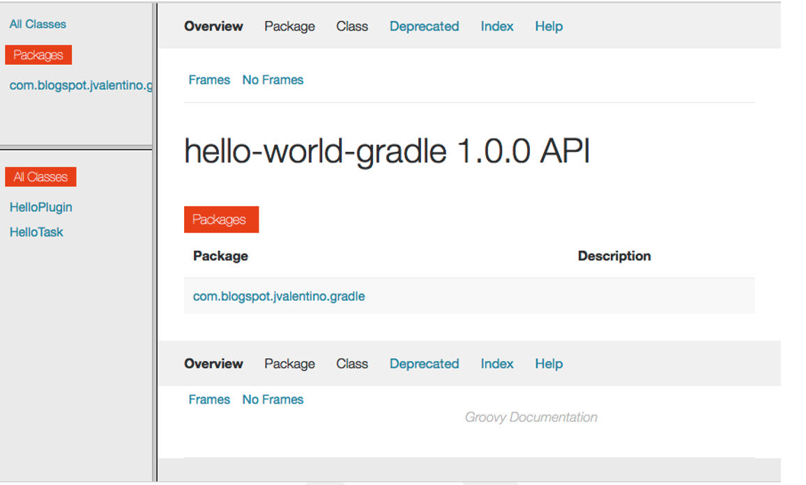
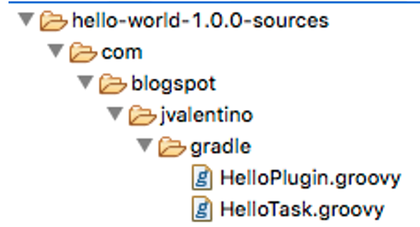
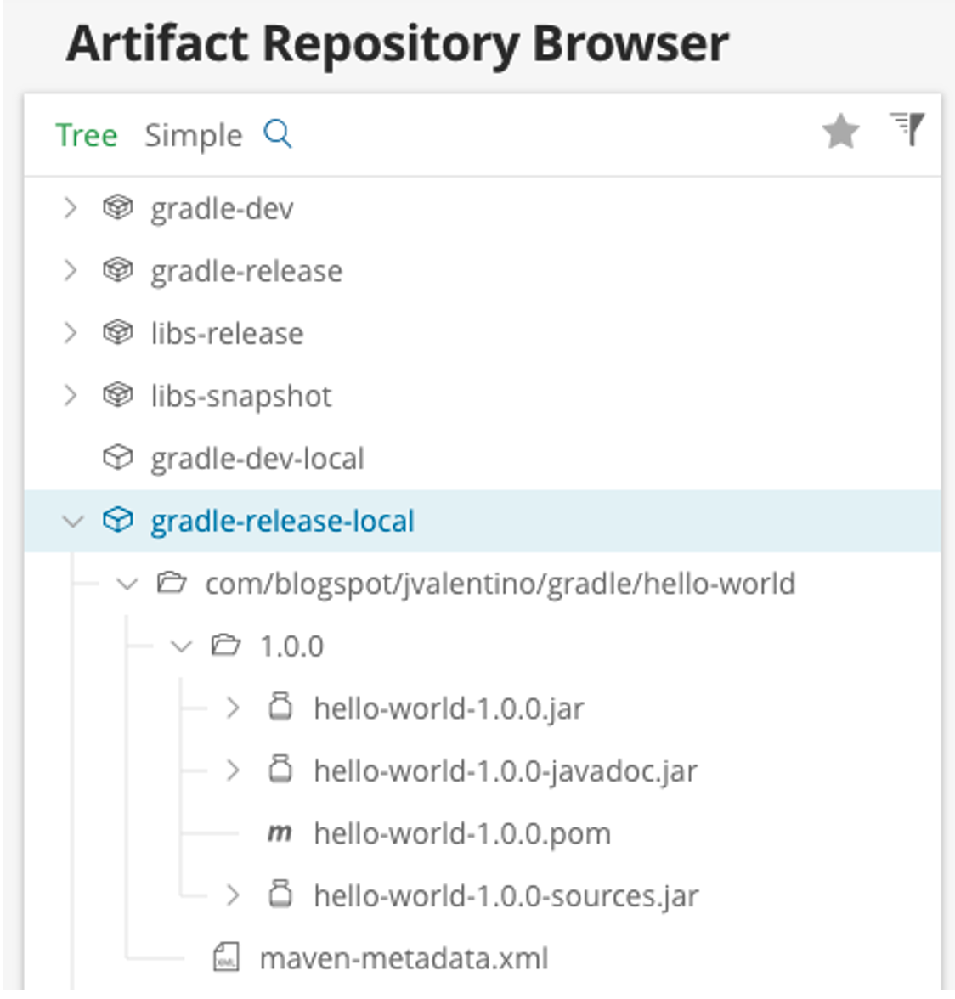
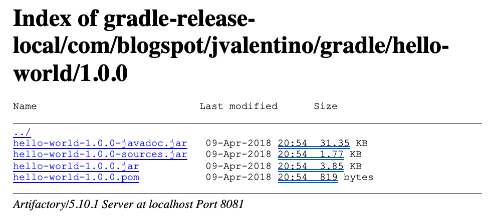

## 3.7 Hello World: Publishing

A library isn’t of much use if you can’t share it. Gradle offers a variety of mechanisms for publishing jars, for using the Maven plugin to JFrog’s Artifactory plugin. The purpose of this plugin is to demonstrate how a plugin jar, its source code, and its documentation can be uploaded using the basic Maven plugin.

 

#### build.gradle

```groovy
// PLUGINS
apply plugin: 'groovy'
apply plugin: 'codenarc'
apply plugin: 'jacoco'
apply plugin: 'maven'

// MAVEN
task sourcesJar(type: Jar, dependsOn: classes) {
    classifier = 'sources'
    from sourceSets.main.allSource
}

task javadocJar(type: Jar, dependsOn: groovydoc) {
    classifier = 'javadoc'
    from groovydoc.destinationDir
}

artifacts {
    archives sourcesJar
    archives javadocJar
}

uploadArchives {
 repositories {
  mavenDeployer {
   repository(url:"http://localhost:8081/artifactory/gradle-release") {
    authentication(userName:"admin", password:"changeit")
   }
  }
 }
}
```

**Line 5: The Maven Plugin**

The maven plugin specifically adds the two tasks to the build:

·   **Install** - Installs the assets and POM to the local maven repository

·   **uploadArchives** – Only present if there is at least one **uploadArchive**, results in the assets and POM bring uploaded to the specified repositories

 

**Lines 50-53: Source Jar**

A common practice is to include the source code with the library distribution. This is helpful in most IDEs, and it allows the developer to jump into the source of the referenced classes in use. This task is of type Jar, which means that it takes the input in the **from** statement, and stores in in a Jar. The **dependsOn** statement means that this task depends on the **classes** task.

 

**Lines 55-58: Javadoc Jar**

Another common practice is to include API documentation with the library distribution. This is helpful in most IDEs by providing popup method and class documentation on mouse-over. This task is of type Jar, which means that it takes the input in the **from** statement, and stores in in a Jar. The **dependsOn** statement means that this task depends on the **groovydoc** task, which comes from the Groovy plugin and handles generating HTML representations of the API using code comments.

 

**Lines 60-63: Marking sources and docs as assets**

The association is with the **sourcesJar** custom task and the **javadocJar** custom task, which guarantees their construction as a part of the build. If your project is supposed to be used as a library, you need to define what are the artifacts of this library and what are the dependencies of these artifacts. (https://docs.gradle.org/current/userguide/artifact_management.html), which is why this is done.

 

**Line 65: Uploading archives**

This section specifies the one or more repositories to which to display the artifacts, which in this case are the jars for the library, sources, and Groovy docs.

 

**Lines 68-70: Repository URL and credentials**

For demonstration purposes I am running a local Artifactory server with some default credentials. Any Maven-like repository such as Nexus will also work, as long as most of the many public repositories.

 

#### Executing the action

```bash
$ gradlew clean build jacocoTestReport uploadArchives
:clean
:compileJava NO-SOURCE
:compileGroovy
:processResources
:classes
:jar
:groovydoc
:javadocJar
:sourcesJar
:assemble
:codenarcMain
:codenarcTest
:compileTestJava NO-SOURCE
:compileTestGroovy
:processTestResources NO-SOURCE
:testClasses
:test
:check
:build
:jacocoTestReport
:uploadArchives

BUILD SUCCESSFUL
```

In Gradle, it is possible to chain together multiple tasks, separating them by spaces. This will execute those tasks in the given order if it can, considering that if one task depends on another, that parent task must run first. You can also choose to run these tasks one at time, which if what you must do if you are using the Eclipse Buildship integration for Gradle.

 

The following is a breakdown of the four tasks used for doing the entire build and uploading the artifacts as a maven deployment:

##### clean

```bash
$ gradlew clean
:clean
```

This task deletes the **build** directory, which is where Gradle stories all of the compiled, built, or otherwise assembled assets. It is recommended that you call clean to guarantee that you aren’t relying on anything preexisting in the **build** directory. This the common name: a clean build.

 

##### build

```bash
$ gradlew build
:compileJava NO-SOURCE
:compileGroovy
:processResources
:classes
:jar
:groovydoc
:javadocJar
:sourcesJar
:assemble
:codenarcMain
:codenarcTest
:compileTestJava NO-SOURCE
:compileTestGroovy
:processTestResources NO-SOURCE
:testClasses
:test
:check
:build

BUILD SUCCESSFUL
```

**build** depends on **check**, **check** depends on **test**, **test** depends on **testClasses**, and so on.  The result is that a number of tasks are called in order to assemble the build assets.

 

**Line 2: compileJava**

This comes from the Groovy plugin, which extends the Java plugin. This task takes **.java** files under **src/main/java** and compiles them into **.class** files under **build/classes/java/main**. The statement of **NO-SOURCE** is used to indicate that there were no files under **src/main/java** so no action was taken.

 

**Line 3: compileGroovy**

From the Groovy plugin, this task takes **.groovy** files under **src/main/groovy** and compiles them into **.class** files under **build/classes/groovy/main**.

 

**Line 4: processResources**

Copies files from **src/main/resources** into **build/resources/main**.

 

**Line 6: jar**

From the Groovy plugin, this task takes all assets that are not test related, specifically:

·   **build/classes/groovy/main**

·   **build/classes/java/main**

·   **build/resources/main**

…and puts them in the root of the library Jar file located at **build/libs/hello-world-1.0.0.jar**.

 

**Line 8: javadocJar**

Task **assemble** depends on **javadocJar**, and **javadocJar** depends on **groovydoc**. The association of **assemble** to **javadocJar** is from the declaration within **artifacts**. This is a custom task that uses existing **groovydoc** functionality to generate an HTML representation of specially annotated classes and methods, which start with /**. This generates **build/libs/hello-world-1.0.0-javadoc.jar**.



**Line 9: sourcesJar**

Task **assemble** depends on **sourcesJar**, which comes from the listing of **sourcesJar** within the declaration of **artifacts**. This task mirrors the internal structure of the library jar, but with the source (.groovy and .java files), where the .class files would be. For most IDEs, this makes it to where users of the library can inspect into referenced classes within the library and see the actual code, instead of the bytecode representation. This generates **build/libs/hello-world-1.0.0-sources.jar**



**Line 11: codenarcMain**

From the **codenarc** plugin, this task is now a part of **check**. Its purpose is to run the ruleset as specified in the **codenarcMain** declaration against the code in **src/main/groovy**.

 

**Line 12: codenarcTest**

From the **codenarc** plugin, this task is now a part of **check**. Its purpose is to run the ruleset as specified in the **codenarcTest** declaration against the code in **src/test/groovy**.

 

**Line 13: compileTestJava**

This comes from the Groovy plugin, which extends the Java plugin. This task takes **.java** files under **src/test/java** and compiles them into **.class** files under **build/classes/java/test**. The statement of **NO-SOURCE** is used to indicate that there were no files under **src/test/java** so no action was taken.

 

**Line 14: compileTestGroovy**

From the Groovy plugin, this task takes **.groovy** files under **src/test/groovy** and compiles them into **.class** files under **build/classes/groovy/test**.

 

**Line 15: processTestResources**

Copies files from **src/test/resources** into **build/resources/test**.

 

**Line 17: test**

Executes the compiled test classes against the compiled main classes and publishes the results under **build/reports/tests** for HTML, and **build/tests-results** for XML.

 

##### jacocoTestReport

```bash
$ gradlew jacocoTestReport
:compileJava NO-SOURCE
:compileGroovy UP-TO-DATE
:processResources UP-TO-DATE
:classes UP-TO-DATE
:jacocoTestReport

BUILD SUCCESSFUL
```

While generating the coverage report depends on having compiled various other resources, since it has already happened there is no need to do it again. This is why **UP-TO-DATE** is specified next to those tasks that do not need to run again. This task results in the code coverage reporting being generated under **build/reports/jacoco**.

 

##### uploadArchives

```bash
$ gradlew uploadArchives
:compileJava NO-SOURCE
:compileGroovy UP-TO-DATE
:processResources UP-TO-DATE
:classes UP-TO-DATE
:jar UP-TO-DATE
:groovydoc UP-TO-DATE
:javadocJar UP-TO-DATE
:sourcesJar UP-TO-DATE
:uploadArchives

BUILD SUCCESSFUL
```

Just like with running **jacocoTestReport** directly after running the **build**, existing tasks have not had any assets change so they do not need to run again.

 

Prior to upload this jars to the designated repository, a Maven POM is also generated:

```xml
<?xml version="1.0" encoding="UTF-8"?>
<project xsi:schemaLocation="http://maven.apache.org/POM/4.0.0 http://maven.apache.org/xsd/maven-4.0.0.xsd" xmlns="http://maven.apache.org/POM/4.0.0"
    xmlns:xsi="http://www.w3.org/2001/XMLSchema-instance">
  <modelVersion>4.0.0</modelVersion>
  <groupId>com.blogspot.jvalentino.gradle</groupId>
  <artifactId>hello-world</artifactId>
  <version>1.0.0</version>
  <dependencies>
    <dependency>
      <groupId>org.codehaus.groovy</groupId>
      <artifactId>groovy-all</artifactId>
      <version>2.4.12</version>
      <scope>compile</scope>
    </dependency>
    <dependency>
      <groupId>org.spockframework</groupId>
      <artifactId>spock-core</artifactId>
      <version>1.1-groovy-2.4</version>
      <scope>test</scope>
    </dependency>
  </dependencies>
</project>
```

The purpose of the POM, which stands for Project Object Model, is to declare all of the dependencies that your application or library means. For example, if I am building application A, which needs B, and B needs C, then A also must need C. This is known as a transitive dependency.

 

Since I am using Artifactory for demonstration purposes, the POM and the related Jar files show in the browser:



Artifactory is just a Maven repository though, so the assets can additionally be accessed directly via their HTTP location:




